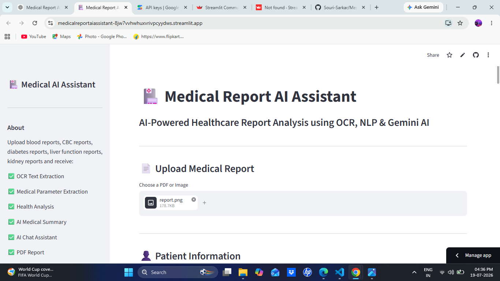
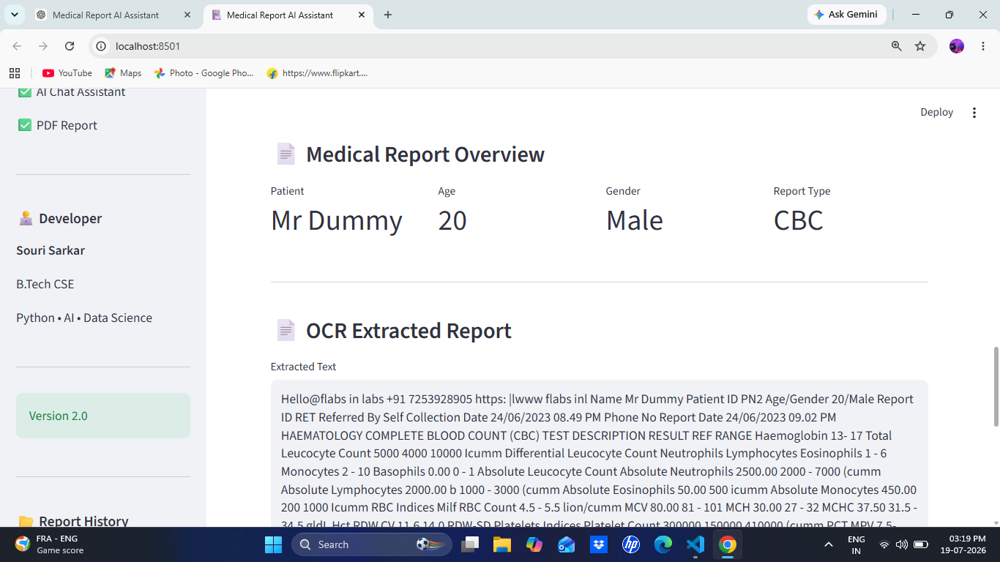
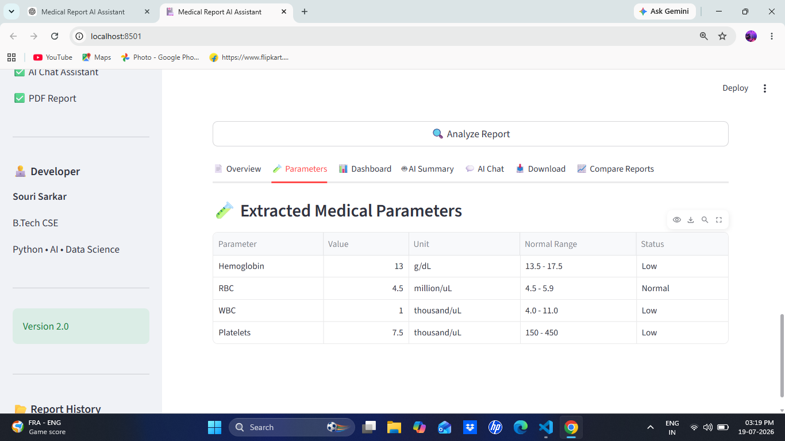
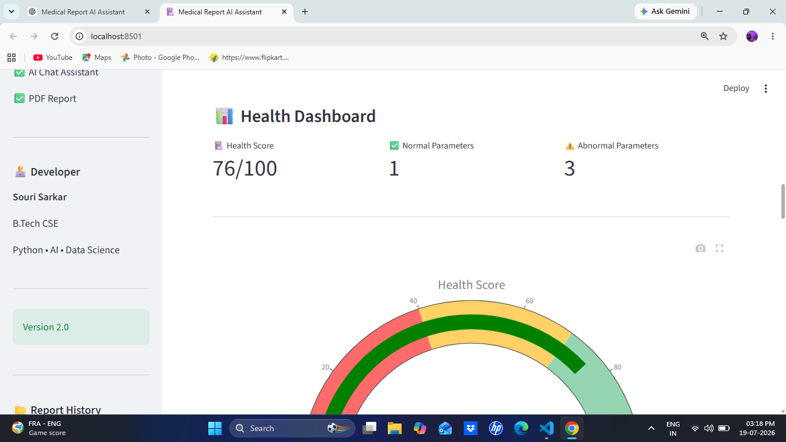
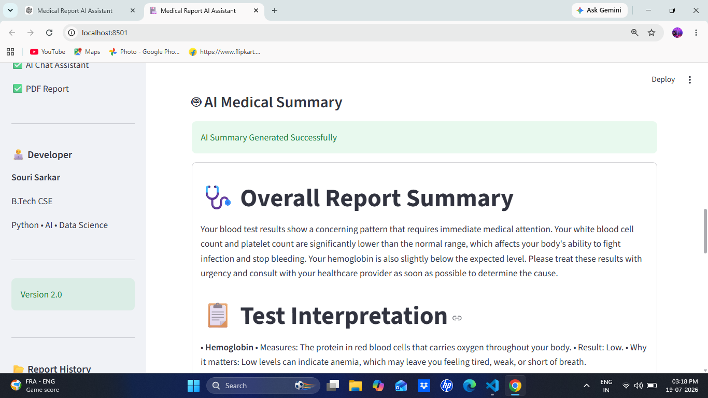
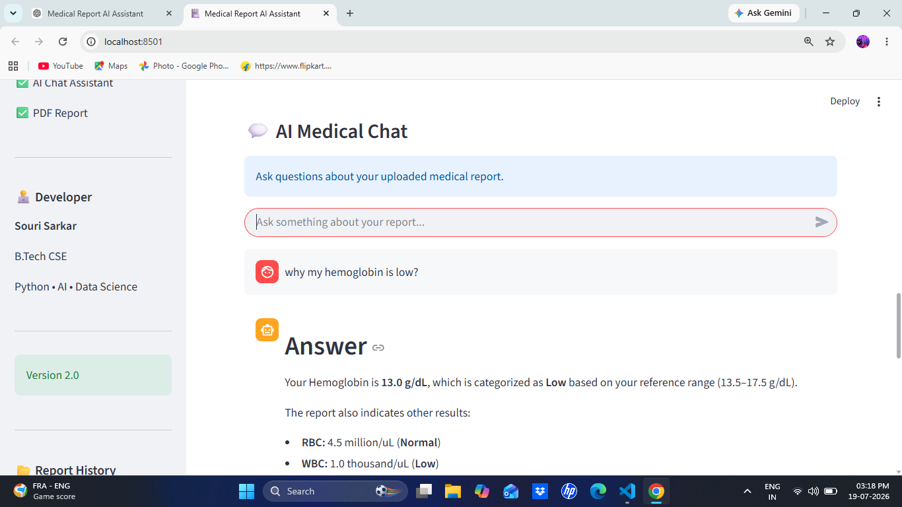

# 🏥 Medical Report AI Assistant

An AI-powered healthcare application that analyzes medical reports using OCR, Natural Language Processing, Rule-Based Analysis, and Google's Gemini AI.

The application extracts medical parameters from uploaded reports, compares them with normal reference ranges, generates health insights, provides AI-powered summaries, and allows users to interact with an intelligent medical chatbot.

---

# 🚀 Features

- 📄 PDF & Image Medical Report Upload
- 🔍 OCR Text Extraction
- 🧪 Automatic Medical Parameter Extraction
- 📊 Health Dashboard with Interactive Charts
- 🤖 AI Medical Summary using Gemini AI
- 💬 AI Medical Chatbot
- 📥 PDF Report Generation
- 📂 Report History
- 📈 Health Score Calculation

---

# 🛠️ Technologies Used

### Programming

- Python

### Framework

- Streamlit

### AI

- Google Gemini API

### OCR

- EasyOCR
- PyMuPDF

### Data Processing

- Pandas
- NumPy

### Visualization

- Plotly

### PDF Generation

- ReportLab

---

# 📂 Project Structure

```
Medical_Report_AI_Assistant/

│── app.py
│── README.md
│── requirements.txt

├── assets/

├── data/

├── models/

├── utils/

├── screenshots/

└── sample_reports/
```

---

# ⚙️ Installation

Clone the repository

```bash
git clone https://github.com/yourusername/Medical_Report_AI_Assistant.git
```

Move inside the project

```bash
cd Medical_Report_AI_Assistant
```

Create virtual environment

```bash
python -m venv venv
```

Activate virtual environment

Windows

```bash
venv\Scripts\activate
```

Install dependencies

```bash
pip install -r requirements.txt
```

Run the application

```bash
streamlit run app.py
```

---

# 📊 Workflow

Medical Report Upload

↓

OCR Text Extraction

↓

Medical Parameter Extraction

↓

Health Analysis

↓

Dashboard Generation

↓

Gemini AI Summary

↓

AI Chat Assistant

↓

PDF Report Generation

---

# 📸 Screenshots

## 🏠 Home Page



---

## 📄 Medical Report Overview



---

## 🧪 Extracted Medical Parameters



---

## 📊 Health Dashboard



---

## 🤖 AI Medical Summary



---

## 💬 AI Medical Chat



---

# 💡 Future Enhancements

- Multi-language support
- Doctor login portal
- Cloud database integration
- Appointment scheduling
- Trend analysis across multiple reports

---

# 👨‍💻 Developer

**Souri Sarkar**

B.Tech – Computer Science & Engineering

Python | Data Science | Machine Learning | AI

---

# 📄 License

This project is developed for educational and portfolio purposes.